# RAG System Query Flow Diagram

## System Architecture Overview

```mermaid
graph TB
    subgraph "Frontend Layer"
        UI[👤 User Interface<br/>HTML/CSS/JS]
        Chat[💬 Chat Component<br/>Input/Messages]
        API_Client[🌐 API Client<br/>Fetch Requests]
    end

    subgraph "Backend API Layer"
        FastAPI[⚡ FastAPI Server<br/>app.py]
        Endpoints[🔗 REST Endpoints<br/>/api/query, /api/courses]
        Models[📋 Pydantic Models<br/>Request/Response]
    end

    subgraph "RAG Core System"
        RAG_Main[🧠 RAG System<br/>rag_system.py]
        Session_Mgr[📚 Session Manager<br/>Conversation History]
        Doc_Proc[📄 Document Processor<br/>Text Chunking]
    end

    subgraph "AI & Search Layer"
        AI_Gen[🤖 AI Generator<br/>Claude Integration]
        Tool_Mgr[🔧 Tool Manager<br/>Search Orchestration]
        Search_Tool[🔍 Course Search Tool<br/>Vector Queries]
    end

    subgraph "Data Storage Layer"
        Vector_Store[🗄️ Vector Store<br/>ChromaDB Interface]
        ChromaDB[(🔢 ChromaDB<br/>Vector Embeddings)]
        Course_Data[📖 Course Documents<br/>Processed Chunks]
    end

    subgraph "External Services"
        Claude_API[☁️ Claude API<br/>Anthropic AI]
        Embedding_Model[🔤 Sentence Transformer<br/>all-MiniLM-L6-v2]
    end

    %% User Flow
    UI --> Chat
    Chat --> API_Client
    API_Client --> FastAPI

    %% API Processing
    FastAPI --> Endpoints
    Endpoints --> Models
    Models --> RAG_Main

    %% RAG Processing
    RAG_Main --> Session_Mgr
    RAG_Main --> AI_Gen
    AI_Gen --> Tool_Mgr
    Tool_Mgr --> Search_Tool

    %% Data Access
    Search_Tool --> Vector_Store
    Vector_Store --> ChromaDB
    ChromaDB --> Course_Data
    Doc_Proc --> Course_Data

    %% External Calls
    AI_Gen --> Claude_API
    Vector_Store --> Embedding_Model

    %% Response Flow (dotted lines)
    Claude_API -.-> AI_Gen
    Vector_Store -.-> Search_Tool
    Search_Tool -.-> Tool_Mgr
    Tool_Mgr -.-> AI_Gen
    AI_Gen -.-> RAG_Main
    RAG_Main -.-> FastAPI
    FastAPI -.-> API_Client
    API_Client -.-> Chat
    Chat -.-> UI

    %% Styling
    classDef frontend fill:#e1f5fe
    classDef backend fill:#f3e5f5
    classDef core fill:#fff3e0
    classDef ai fill:#e8f5e8
    classDef data fill:#fce4ec
    classDef external fill:#f1f8e9

    class UI,Chat,API_Client frontend
    class FastAPI,Endpoints,Models backend
    class RAG_Main,Session_Mgr,Doc_Proc core
    class AI_Gen,Tool_Mgr,Search_Tool ai
    class Vector_Store,ChromaDB,Course_Data data
    class Claude_API,Embedding_Model external
```

## Detailed Query Processing Flow

```mermaid
sequenceDiagram
    participant 👤 as User
    participant 🖥️ as Frontend<br/>(script.js)
    participant ⚡ as FastAPI<br/>(app.py)
    participant 🧠 as RAG System<br/>(rag_system.py)
    participant 📚 as Session Mgr<br/>(session_manager.py)
    participant 🤖 as AI Generator<br/>(ai_generator.py)
    participant 🔧 as Tool Manager<br/>(search_tools.py)
    participant 🗄️ as Vector Store<br/>(vector_store.py)
    participant 🔢 as ChromaDB
    participant ☁️ as Claude API

    👤->>+🖥️: 1. Type query & send
    🖥️->>🖥️: 2. Show loading animation
    🖥️->>+⚡: 3. POST /api/query<br/>{"query": "...", "session_id": "..."}

    ⚡->>⚡: 4. Validate request
    ⚡->>+🧠: 5. rag_system.query(query, session_id)

    🧠->>🧠: 6. Create prompt template
    🧠->>+📚: 7. get_conversation_history(session_id)
    📚-->>-🧠: 8. Return chat history

    🧠->>+🤖: 9. generate_response(query, history, tools)
    🤖->>🤖: 10. Build system prompt + context
    🤖->>+☁️: 11. Claude API call with tools

    Note over ☁️: 12. Claude analyzes:<br/>"Is this course-specific?"

    alt Course-Specific Query
        ☁️->>+🔧: 13a. Tool call: search_courses(query)
        🔧->>+🗄️: 14a. similarity_search(query, limit=5)
        🗄️->>🗄️: 15a. Generate query embedding
        🗄️->>+🔢: 16a. Vector similarity search
        🔢-->>-🗄️: 17a. Top matching chunks
        🗄️-->>-🔧: 18a. Formatted search results
        🔧-->>-☁️: 19a. Return relevant course content
        ☁️->>☁️: 20a. Synthesize answer from search
    else General Knowledge
        ☁️->>☁️: 13b. Use training knowledge
    end

    ☁️-->>-🤖: 21. Generated response
    🤖-->>-🧠: 22. Return AI response

    🧠->>+🔧: 23. get_last_sources()
    🔧-->>-🧠: 24. Source document list
    🧠->>🔧: 25. reset_sources()

    🧠->>+📚: 26. add_exchange(session_id, query, response)
    📚-->>-🧠: 27. Conversation updated

    🧠-->>-⚡: 28. Return (response, sources)
    ⚡-->>-🖥️: 29. JSON response<br/>{"answer": "...", "sources": [...], "session_id": "..."}

    🖥️->>🖥️: 30. Remove loading animation
    🖥️->>🖥️: 31. Render markdown response
    🖥️-->>-👤: 32. Display formatted answer

    rect rgb(230, 255, 230)
        Note over 👤,☁️: ✨ Key Features:<br/>• Intelligent tool selection by Claude<br/>• Vector semantic search<br/>• Session-based memory<br/>• Context-aware responses
    end
```

## Component Breakdown

### Frontend Layer
- **HTML**: Chat interface with input field and message display
- **JavaScript**: Handles user interactions, API calls, and response rendering
- **Features**: Loading states, markdown rendering, session management

### Backend API Layer
- **FastAPI**: REST API with CORS, static file serving
- **Endpoints**: `/api/query` for questions, `/api/courses` for stats
- **Models**: Pydantic schemas for request/response validation

### RAG System Core
- **RAG System**: Main orchestrator coordinating all components
- **Session Manager**: Maintains conversation history per session
- **Document Processor**: Chunks and structures course materials

### AI & Search Layer
- **AI Generator**: Interfaces with Claude API, manages prompts/context
- **Tool Manager**: Provides search capabilities to Claude
- **Search Tools**: Course-specific search with vector similarity

### Data Layer
- **Vector Store**: ChromaDB interface for embeddings storage/retrieval
- **ChromaDB**: Vector database storing course content embeddings
- **Models**: Data structures (Course, Lesson, CourseChunk)

## Flow Characteristics

1. **Intelligent Routing**: Claude decides when to search vs use general knowledge
2. **Context Preservation**: Conversation history maintained across queries
3. **Semantic Search**: Vector similarity finds relevant course content
4. **Tool Integration**: Search results seamlessly integrated into responses
5. **Session Management**: Each conversation maintains its own context
6. **Error Handling**: Graceful fallbacks at each layer